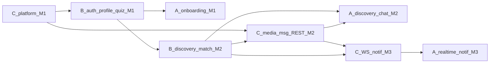

# Shared Roadmap — Personality-Based Dating Platform

**Audience:** Person A (frontend), Person B (identity/matching backend), Person C (messaging/media/infra)  
**Maturity target:** Startup-style MVP — production-minded APIs, Redis, queues, realtime chat, observability  
**Architecture:** Modular monolith in the existing Go backend; React SPA on Vite  
**API version:** New work uses `/api/v1/...`. Keep current `/api/...` until A migrates, then deprecate.

This document is the single source of truth for **what we build**, **who owns it**, **in what order**, and **how B and C hand off events**. Detailed implementation specs live in the person docs.

---

## 1. Product story

A coherent dating loop:

1. User registers and verifies session.
2. Completes a **Big Five personality assessment**.
3. Sets **preferences** (age, gender, distance, trait weights).
4. Uploads photos and fills a rich **profile**.
5. Browses a **compatibility-sorted discovery feed**, likes or passes.
6. On **mutual match**, can open a conversation.
7. **Chats in realtime**, with **notifications** for matches and messages.

Everything we build must serve that loop. Nice-to-haves outside this loop are deferred (see §8).

---

## 2. Full feature inventory

| ID | Feature | Owner | Depends on | Milestone |
|----|---------|-------|------------|-----------|
| F01 | Register / login with access + refresh tokens | B | C rate-limit middleware | M1 |
| F02 | Logout / refresh revoke / session list | B | Redis (C) for refresh store | M1 |
| F03 | Password reset (email token) | B | C email worker stub | M2 |
| F04 | Current user (`/me`) with onboarding flags | B | — | M1 |
| F05 | Rich profile CRUD (bio, gender, DOB, location, interests) | B | — | M1 |
| F06 | Profile photo gallery (URLs from media service) | B + C | F20 media | M2 |
| F07 | Personality assessment quiz + score persist | B | — | M1 |
| F08 | Retake rules / assessment history | B | F07 | M2 |
| F09 | Preferences CRUD (age, gender, distance, trait weights) | B | — | M1 |
| F10 | Discovery feed sorted by compatibility + filters | B | F07, F09, Redis cache | M2 |
| F11 | Cursor pagination for discovery | B | F10 | M2 |
| F12 | Like / pass actions | B | F10 | M2 |
| F13 | Mutual match creation + match list | B | F12 | M2 |
| F14 | Block user | B | — | M3 |
| F15 | Report user (stub + persist) | B | C moderation queue optional | M3 |
| F16 | Match payloads without leaking email | B | — | M1 |
| F17 | Conversations gated by mutual match | C | F13 (B) | M2 |
| F18 | Message history REST (cursor pagination) | C | F17 | M2 |
| F19 | WebSocket realtime send/receive | C | F18, Redis pub/sub | M3 |
| F20 | Presigned photo upload + thumbnail worker | C | Object storage | M2 |
| F21 | In-app notifications (match, message) | C | Queue + F13/F18 events | M3 |
| F22 | Email / push notification stubs | C | F21 | M3 |
| F23 | Health / readiness probes | C | — | M1 |
| F24 | Rate limiting, request IDs, structured logs | C | Redis | M1 |
| F25 | Metrics + OpenTelemetry traces | C | — | M3 |
| F26 | Docker Compose (Postgres, Redis, MinIO, API, worker) | C | — | M1 |
| F27 | Basic CI (lint, test, build) | C | — | M2 |
| F28 | Frontend auth UX (login, register, refresh, logout) | A | F01–F04 | M1 |
| F29 | Frontend onboarding: quiz + preferences + profile | A | F05–F09 | M1–M2 |
| F30 | Frontend discovery, like/pass, matches | A | F10–F13 | M2 |
| F31 | Frontend chat (REST then WS) | A | F17–F19 | M2–M3 |
| F32 | Frontend media upload gallery | A | F20 | M2 |
| F33 | Frontend notifications inbox | A | F21 | M3 |
| F34 | Frontend performance (cache, split, virtualize) | A | ongoing | M1–M4 |

---

## 3. Ownership matrix

| Area | A | B | C |
|------|---|---|---|
| React pages, routing, design system | Own | Consult (API shapes) | Consult (WS/media contracts) |
| FE caching, code splitting, a11y | Own | — | — |
| Auth / users / sessions | Consume | Own | Provide Redis + rate limit |
| Profiles / personality / preferences | Consume | Own | — |
| Matching / likes / blocks | Consume | Own | Consume match events |
| Conversations / messages / WS | Consume | Gate via match ID | Own |
| Media uploads / thumbnails | Consume | Store URLs on profile | Own |
| Notifications | Consume | Emit domain events | Own workers + API |
| Postgres schema (domain tables) | — | Own B tables | Own C tables; shared migrations process |
| Redis / queues / Docker / CI / OTel | — | Consume | Own |
| JWT secret & validation helpers | — | Define claims | Share package / middleware |

**Rule:** B and C never edit each other's domain packages without a written contract change in this roadmap. Shared code lives under `backend/internal/platform/` (owned by C, used by B).

---

## 4. Target architecture

```
Browser (A)
  ├─ REST  /api/v1/*  ──► Go API (modular monolith)
  │                         ├─ B: auth, profile, personality, prefs, match
  │                         └─ C: messaging, media, notifications
  └─ WS    /ws            ──► WebSocket gateway (C)
                                │
                PostgreSQL ◄────┤
                Redis      ◄────┤  cache, rate limit, pub/sub, refresh tokens
                Queue      ◄────┤  email, thumbnails, notifications
                Object store ◄──┘  photos
```

**Day-one deployment:** one API process + one worker process + Compose services.  
**Extract later (if needed):** WS gateway and media worker as separate binaries — packages are already isolated.

---

## 5. Package layout (backend)

```
backend/
  cmd/
    server/          # HTTP + WS entry
    worker/          # queue consumers (C)
    seed/            # existing seed (extend)
  internal/
    platform/        # C: config, db, redis, queue, middleware, telemetry
    auth/            # B (expand existing)
    profile/         # B
    personality/     # B
    preferences/     # B
    matching/        # B
    messaging/       # C
    media/           # C
    notifications/   # C
    models/          # shared DTOs carefully; prefer domain-local types
  migrations/        # numbered SQL; both B and C add files with ownership prefix
```

Migration naming: `00N_b_*.sql` or `00N_c_*.sql` so ownership is obvious. Coordinate sequence numbers in standup.

---

## 6. API conventions (all owners)

- Base path: `/api/v1`
- Auth: `Authorization: Bearer <access_token>`
- Errors: `{ "error": { "code": "string", "message": "string", "details": {} } }`
- Pagination: cursor-based where lists can grow (`limit`, `cursor`); response `{ "items": [], "next_cursor": "..." | null }`
- IDs: UUID strings
- Timestamps: RFC3339 UTC
- Never return `password_hash`; never return other users' emails in discovery/match payloads
- Idempotency: `Idempotency-Key` header on like/pass and send-message (recommended M3)

---

## 7. B ↔ C event contracts

Events are published by the owning domain onto the queue (Redis Streams or equivalent). Payload is JSON. Consumers are idempotent on `event_id`.

| Event | Publisher | Subscribers | Payload (minimum) |
|-------|-----------|-------------|-------------------|
| `match.created` | B | C notifications; C may pre-create conversation optional | `event_id`, `match_id`, `user_a_id`, `user_b_id`, `created_at` |
| `user.blocked` | B | C messaging (hide/disable thread) | `event_id`, `blocker_id`, `blocked_id` |
| `message.created` | C | C notifications (other participant) | `event_id`, `conversation_id`, `message_id`, `sender_id`, `recipient_id`, `preview` |
| `media.processed` | C | B profile (optional webhook/callback or B polls) | `event_id`, `user_id`, `asset_id`, `urls{original,thumb}` |
| `auth.password_reset_requested` | B | C email worker | `event_id`, `user_id`, `email`, `reset_token`, `expires_at` |

**Synchronous contracts:**

- C messaging `POST /conversations` requires a valid `match_id` owned by B (C calls B's internal `MatchRepo.Get` / shared query — same DB in monolith).
- B profile stores `photo_urls` produced by C media; B does not talk to S3 directly.
- Both validate JWT via shared `platform/auth` helpers (claims defined by B).

---

## 8. Out of scope (MVP)

Documented so the team does not scope-creep:

- Payments / subscriptions
- Video / voice calls
- ML re-rankers / collaborative filtering
- Multi-region active-active
- Full trust & safety ops console
- OAuth social login (can add post-MVP)
- Native mobile apps (responsive web first)

---

## 9. Milestones

### M1 — Foundations (weeks 1–2)

**Goal:** Secure sessions, profile + quiz + preferences APIs, platform skeleton, FE auth + onboarding shell.

| Person | Deliverables |
|--------|----------------|
| C | Compose (Postgres, Redis, MinIO), `platform/` middleware (request ID, CORS, rate limit), health/ready, Redis client |
| B | Access + refresh auth, `/me` with flags, profile CRUD, quiz + traits, preferences CRUD, strip email from public user DTOs |
| A | Login/register/refresh, onboarding wizard skeleton wired to B stubs, API client v1 |

**Exit criteria:** User can register, complete quiz + prefs + basic profile via UI; API behind rate limits; Compose boots locally.

### M2 — Discovery, media, messaging REST (weeks 3–4)

**Goal:** Real discovery loop + photos + chat history (polling OK).

| Person | Deliverables |
|--------|----------------|
| B | Scored feed + filters + cursor, like/pass, mutual match + match list, emit `match.created` |
| C | Presigned upload + thumbnail worker, conversation gated by match, message REST + cursor, fix conversation list bug, CI pipeline |
| A | Discovery UI, like/pass, matches list, photo upload, chat with REST polling |

**Exit criteria:** Two seeded users can mutual-match and exchange messages via UI; photos appear on profiles.

### M3 — Realtime, notifications, safety (weeks 5–6)

**Goal:** Feels like a product.

| Person | Deliverables |
|--------|----------------|
| B | Block/report, retake rules, cache warm for traits, harden match queries |
| C | WebSocket gateway + Redis pub/sub, in-app notifications API + worker, email stubs, OTel/metrics |
| A | WS chat client, notifications bell/inbox, block/report UX |

**Exit criteria:** Messages appear without refresh; match creates notification; basic metrics dashboards locally.

### M4 — Harden & scale proof (week 7)

**Goal:** Load-test and polish.

| Person | Deliverables |
|--------|----------------|
| A | Virtualized lists, image CDN URLs, bundle budget, error boundaries, a11y pass |
| B | Query/index review, Redis cache hit rates for discovery, load-test match endpoint |
| C | Horizontal API replica demo, WS fanout across 2 instances, worker concurrency, runbooks |

**Exit criteria:** Documented load numbers; no P0 bugs; README runbooks updated.

---

## 10. Dependency order (keep A unblocked)



**Stub rule:** If a dependency is late, the owner publishes an OpenAPI stub + fixture responses so A can continue against MSW / mocked handlers.

---

## 11. Current codebase baseline (honest)

| Exists today | Gap |
|--------------|-----|
| Register/login JWT (24h access only) | No refresh, reset, sessions |
| Profile get/update | No interests, gallery, visibility |
| `personality_scores` table + seed | No quiz API; new users have no traits |
| `preferences` table | Unused by handlers/UI |
| Match list with simple similarity | Not sorted by score; no likes; emails leaked |
| Conversations + messages REST | Not match-gated; list query passes extra arg; no WS |
| Vite SPA pages | No quiz, prefs, likes, WS, uploads, notifications |
| No Redis/Docker/CI/tests | Entire platform layer missing |

Person docs expand each gap into concrete work.

---

## 12. Definition of Done (team-wide)

A feature is done when:

1. Spec in the owning person doc is implemented.
2. Migration (if any) is applied and documented.
3. API contract matches §6; OpenAPI or handler comments updated.
4. Unit or integration tests cover happy path + one failure path (B/C).
5. A has a working UI path or an agreed stub.
6. Events in §7 are emitted/consumed where applicable.
7. No secrets committed; env vars documented in `env.example` (C maintains template).

---

## 13. Communication

- Contract changes to events or public JSON fields: update this file **first**, then person docs, then code.
- Weekly sync: M-exit checklist review.
- Blocking issues: tag owner in PR / issue with feature ID (`F10`, etc.).

---

## Related documents

- [PERSON_A_FRONTEND.md](./PERSON_A_FRONTEND.md)
- [PERSON_B_BACKEND.md](./PERSON_B_BACKEND.md)
- [PERSON_C_BACKEND.md](./PERSON_C_BACKEND.md)
